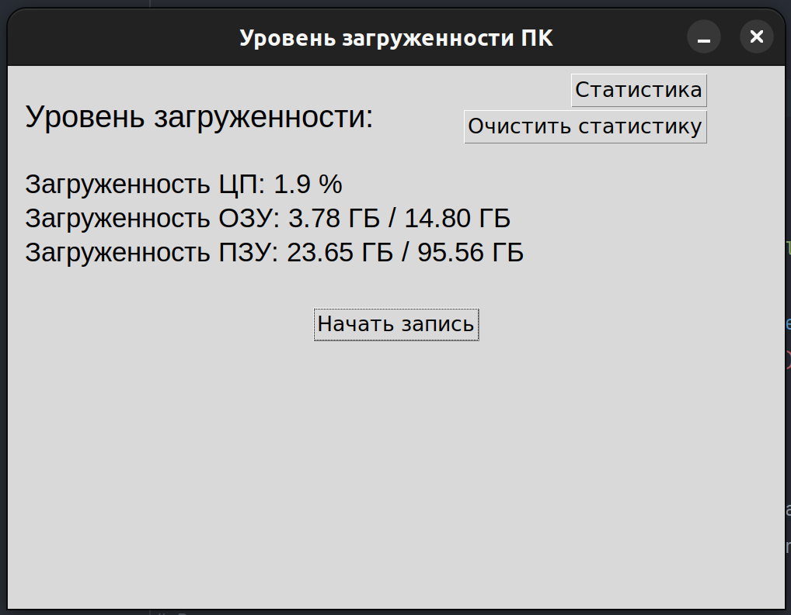
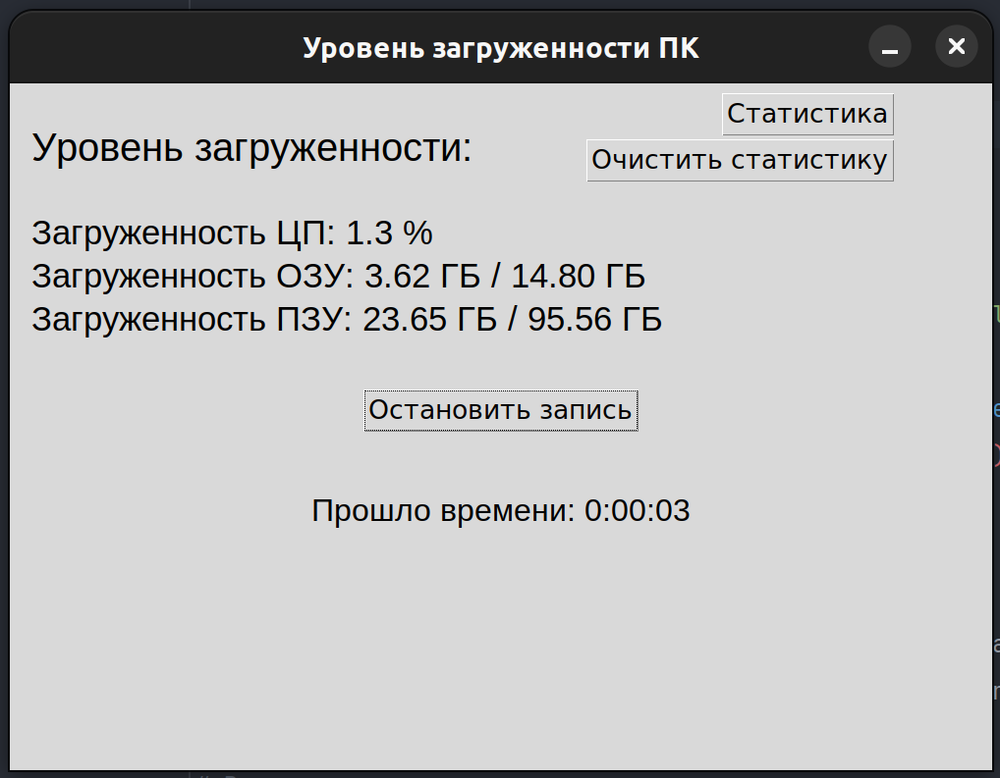
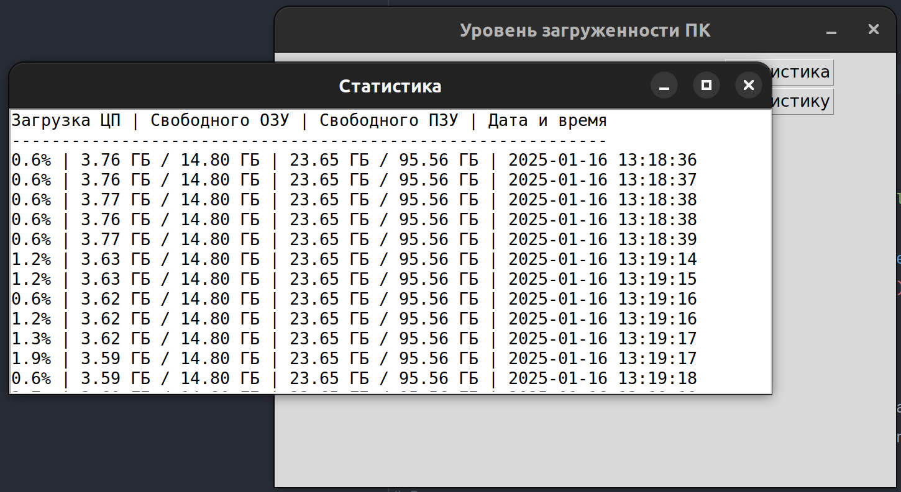
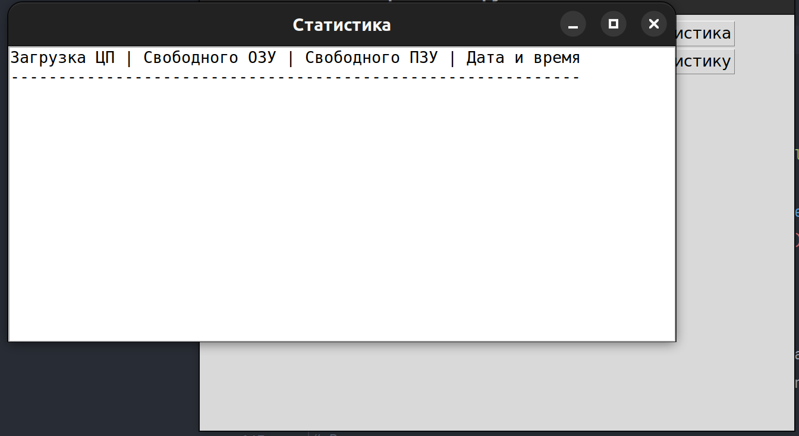
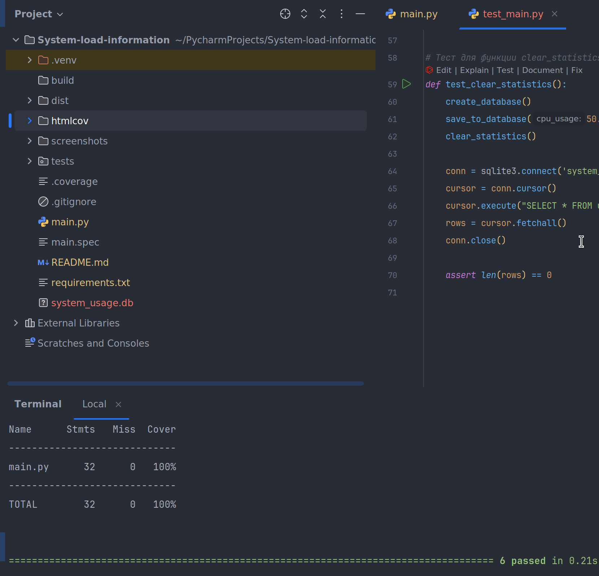

# System Load Information

Приложение для мониторинга загруженности системы (CPU, RAM, Disk) с возможностью записи данных в базу данных и просмотра статистики.

## Возможности

- Отображение текущей загруженности:
  - Процессора (CPU)
  - Оперативной памяти (RAM)
  - Дискового пространства (Disk)
- Запись данных в базу данных SQLite.
- Просмотр статистики загруженности.
- Очистка статистики.

## Установка

1. Клонируйте репозиторий:
   ```
   https://github.com/RamilNigamatulin/System-load-information.git
   ```
2. Создайте виртуальное окружение и активируйте его. 
3. Установите зависимости:
   ```
   pip install -r requirements.txt
   ```

## Запуск

1. Запустите приложение "main.py".

## Использование

 - Начать/Остановить запись: Нажмите кнопку "Начать запись", чтобы начать запись данных в базу данных. Кнопка изменится на "Остановить запись".

 - Статистика: Нажмите кнопку "Статистика", чтобы открыть окно с историей записей.

 - Очистить статистику: Нажмите кнопку "Очистить статистику", чтобы удалить все записи из базы данных.

## Сборка приложения

 - Чтобы собрать приложение в один исполняемый файл, используйте PyInstaller:
   ```
   pyinstaller --onefile --windowed main.py
   ```
 - Исполняемый файл будет находиться в папке dist.

## Скриншоты
 - Главное окно


 - Окно статистики



 - Код покрыт тестами на 100%.


 - Для запуска тестов введите:
  ```
  pytest --cov=main tests/test_main.py    
  ```
